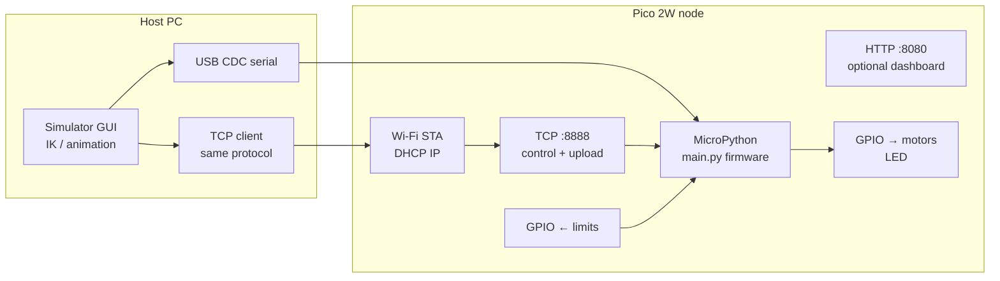

# Fab Academy Week 11 — Networking, Communication & Connected Nodes

**Course prompt (paraphrased):** *Design, build, and connect wired or wireless node(s) with network or bus addresses and a local input and/or output device(s).*

**Project:** Robot Arm Simulator + Raspberry Pi Pico 2W embedded controller  
**Repository:** Robot Arm Sim — desktop simulator (`Robot-Arm-Sim/`) and MicroPython firmware (`Robot-Arm-Sim/firmware/`)

This document maps each requirement of the assignment to concrete artifacts in this repository so it can be submitted as Week 11 documentation (HTML export, PDF, or GitLab Pages).

---

## 1. Assignment criteria → evidence

| Requirement | How this project satisfies it |
|---------------|-------------------------------|
| **Design** | System architecture: PC runs IK, trajectory generation, and visualization; Pico executes motor stepping, optional homing, and networking. Geometry and motor parameters are configured in the GUI and injected into firmware at deploy time (`hardware/micropython_deployer.py`). |
| **Build** | Fabricated stack: (1) desktop application on a host PC, (2) RP2040-based **Pico 2W** running **MicroPython**, (3) motor drivers (e.g. ULN2003 + 28BYJ-48, or STEP/DIR), (4) optional **limit / home switches** on GPIO inputs. |
| **Connect wired or wireless** | **Wired:** USB serial (CDC) between PC and Pico — used for flashing, raw REPL deploy, and runtime control. **Wireless:** Pico joins a Wi‑Fi infrastructure (STA), exposes a **TCP** server for the same logical protocol as USB. |
| **Network or bus addresses** | **USB:** serial port identifier (e.g. `COM7` on Windows, `/dev/ttyACM0` on Linux) selects the device. **Wi‑Fi:** **IPv4 address + TCP port** (default control channel **8888**; optional onboard **HTTP dashboard** on **8080**) uniquely identifies the node on the LAN. Messages are line-oriented text (`J0:…,J1:…`) — a simple application-layer protocol on top of the transport. |
| **Local input and/or output** | **Outputs:** GPIO to motor drivers (step/direction or 28BYJ coil patterns), optional RC servo PWM, onboard **LED** toggle for link checks. **Inputs:** optional **home/limit** pins per joint (`home_pin` in motor configuration), read in the main loop for homing sequences and status. |

Together, these satisfy the spirit of Week 11: a **networked embedded node** with explicit **addressing**, **local actuation**, and **local sensing**, integrated with a host application.

---

## 2. System overview



**Roles**

- **Host node:** Planning, visualization, operator interface.
- **Embedded node (Pico):** Real-time follower — converts streamed joint angles to steps or servo PWM, enforces configured limits, acceleration, and optional homing.

---

## 3. Addressing (explicit)

| Layer | Wired (USB) | Wireless (Wi‑Fi) |
|-------|-------------|-------------------|
| Physical | USB cable to Pico | 2.4 GHz IEEE 802.11 (typical home lab AP) |
| Device selection | Serial **COM port** or `/dev/ttyACM*` | **IP address** (shown after association, e.g. `192.168.1.42`) |
| Service | CDC ACM serial stream | **TCP port** — default **8888** for control stream and firmware upload negotiation |
| Extra | — | **HTTP** on **8080** for browser dashboard (FK/IK snapshot, joint jog, limit indicators) when enabled in firmware |

The Pico is therefore unambiguously reachable as **`IP:8888`** on the LAN for the simulator’s Hardware panel and **`http://IP:8080`** for the optional web UI.

---

## 4. Local outputs

- **Motors:** Stepper channels (28BYJ half-step or STEP/DIR drivers) pull joints toward streamed angle targets with accel-limited stepping (`Robot-Arm-Sim/firmware/pico_control_script.py`).
- **Servo (optional):** PWM output on a configured GPIO for RC servos.
- **Indicator:** Board **LED** toggled via serial/Wi‑Fi command for connectivity checks.

These are **local** to the microcontroller — no cloud dependency.

---

## 5. Local inputs

- **Home / limit switches:** Optional **digital GPIO** per joint (`home_pin`, polarity `NO`/`NC`). Firmware reads pins during homing and optional streaming so pressed vs released state is visible on the PC and on the HTTP dashboard (when Wi‑Fi is enabled).

Even one switch demonstrates **local input**; multiple joints can each expose a limit channel.

---

## 6. Protocol (communication contract)

Host → Pico messages are ASCII lines, for example:

```text
J0:12.34,J1:-5.67,J2:10.00,J3:0.00
```

Pico → Host acknowledges with `OK` or error lines — see `Robot-Arm-Sim/hardware/protocol.py` and firmware header comments. **Wi‑Fi upload** uses a separate line protocol (`UPLOAD_BEGIN`, chunked hex payloads) so firmware can be replaced over the air once the device already runs a compatible stack.

This is intentionally simple so it doubles as a **serial field bus** idiom (logical addressing by joint index `J0`…`Jn`).

---

## 7. Safety & ethics (documentation requirement)

- Treat moving mechanisms as **pinch and collision hazards**; use **E-stop**, current limits, and clear workspace rules.
- Wi‑Fi control assumes a **trusted LAN** — there is no cryptographic pairing in the educational firmware path; document that limitation for instructors.

---

## 8. Related documents

- [**FAB_PROJECT_DOCUMENTATION.md**](FAB_PROJECT_DOCUMENTATION.md) — full project write-up.
- [**ARCHITECTURE.md**](ARCHITECTURE.md) — simulator internals.
- [**AI_HANDOFF.md**](AI_HANDOFF.md) — subsystem map for developers.

---

## 9. Submission checklist (student-facing)

- [ ] Replace placeholders with **your name**, **Fab Lab / region**, and **license** if required by your instructor.
- [ ] Add **photos**: Pico + wiring, motor drivers, limit switches (if used), screenshot of Hardware panel with IP/port.
- [ ] Add **short video** (optional): jog from simulator over USB, then repeat over Wi‑Fi.
- [ ] Link this file from your **Fab Academy documentation repository** or GitLab Pages index.

---

*This file is intended to satisfy the Fab Academy **Week 11** prompt on connected nodes, addressing, and local I/O when paired with the implemented codebase and hardware described above.*
